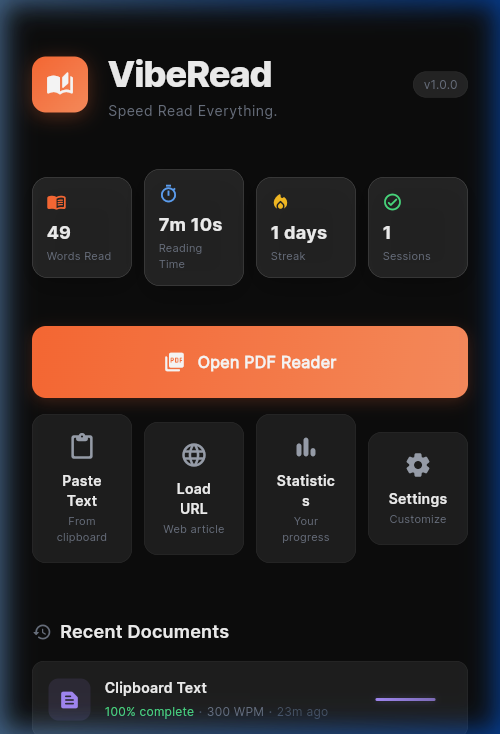
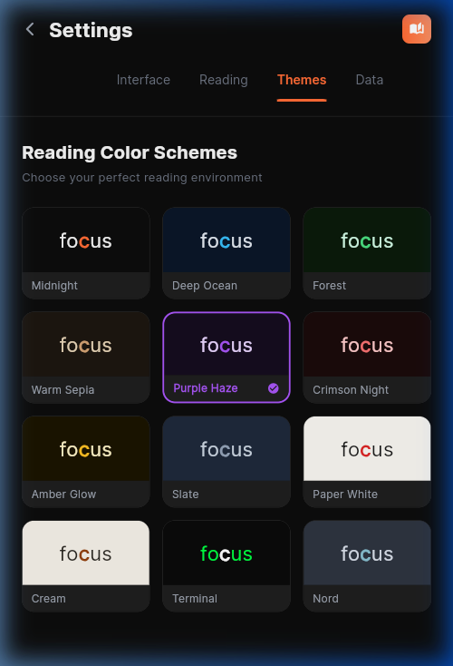
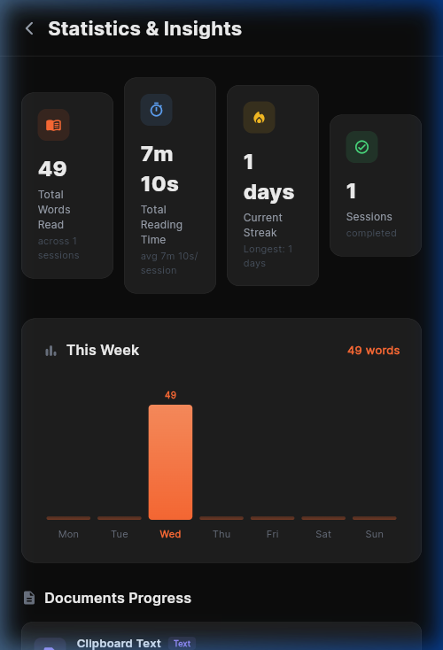
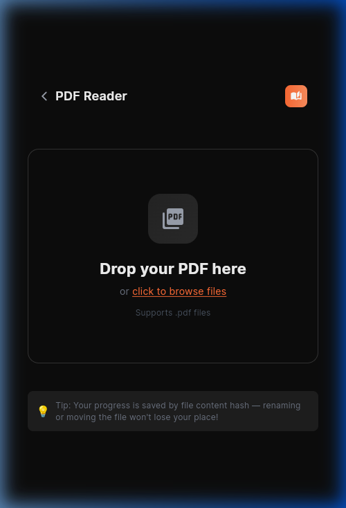
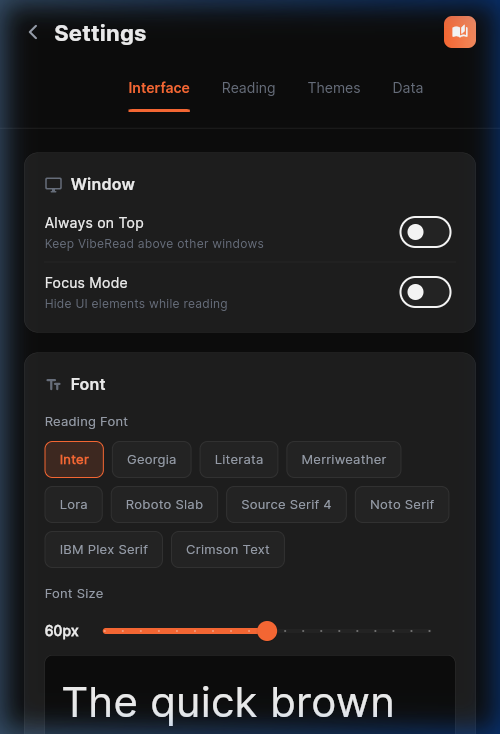
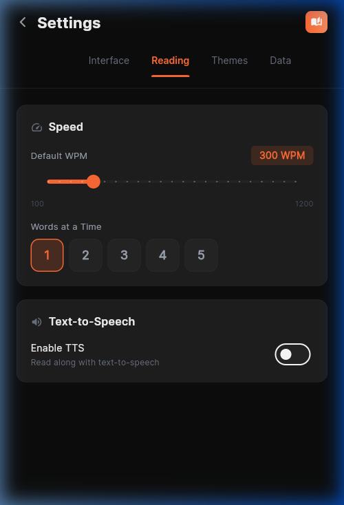

<h1 align="center">
  📖 VibeRead
</h1>

<p align="center">
  <strong>Speed Read Everything.</strong><br/>
  A premium mobile speed reading app built with Flutter
</p>

<p align="center">
  
  
  
  
  
</p>

<p align="center">
  
  &nbsp;&nbsp;
  
  &nbsp;&nbsp;
  
</p>

---

## ✨ What is VibeRead?

**VibeRead** is a premium mobile speed reading application that uses **RSVP (Rapid Serial Visual Presentation)** to help you read 2–5x faster. It displays words one at a time at your chosen speed, leveraging the **Optimal Recognition Point (ORP)** technique to minimize eye movement and maximize comprehension.

Load PDFs, paste text, or fetch web articles — then speed read through them with a gorgeous, distraction-free interface. Your progress is automatically saved by content hash, so you never lose your place.

---

## 📸 Screenshots

<table>
  <tr>
    <td align="center"><strong>🏠 Home Dashboard</strong></td>
    <td align="center"><strong>📄 PDF Reader</strong></td>
    <td align="center"><strong>📊 Statistics</strong></td>
  </tr>
  <tr>
    <td></td>
    <td></td>
    <td></td>
  </tr>
  <tr>
    <td align="center"><strong>⚙️ Settings</strong></td>
    <td align="center"><strong>🎨 12 Themes</strong></td>
    <td align="center"><strong>🚀 Speed Controls</strong></td>
  </tr>
  <tr>
    <td></td>
    <td></td>
    <td></td>
  </tr>
</table>

---

## 🎯 Key Features

### 📖 RSVP Speed Reader

| Feature                | Description                                                                      |
| ---------------------- | -------------------------------------------------------------------------------- |
| **ORP Highlighting**   | The focal letter is highlighted in your accent color for faster word recognition |
| **Adjustable WPM**     | Read at 100 – 1,200 words per minute                                             |
| **Words at a Time**    | Display 1–5 words simultaneously                                                 |
| **Punctuation Pacing** | Smart pauses at periods, commas, and brackets for natural rhythm                 |
| **Context Lines**      | Optional surrounding words shown above/below the focal word                      |
| **Gesture Controls**   | Tap to play/pause, swipe to seek, pinch to adjust speed                          |

### 📄 PDF Reader

| Feature               | Description                                              |
| --------------------- | -------------------------------------------------------- |
| **Drag & Drop**       | Drop PDF files directly into the app                     |
| **File Picker**       | Browse and select PDFs from your device                  |
| **Text Extraction**   | Automatic page-by-page text extraction for speed reading |
| **SHA-256 Hashing**   | Progress tracked by file content, not filename           |
| **Smart Resume**      | Automatically offers to resume from where you left off   |
| **Thumbnail Sidebar** | Page navigation with text previews                       |

### 🎨 12 Premium Reading Themes

Choose your perfect reading environment:

|                   |                    |                      |
| :---------------: | :----------------: | :------------------: |
|  🌙 **Midnight**  | 🌊 **Deep Ocean**  |    🌲 **Forest**     |
| 📜 **Warm Sepia** | 💜 **Purple Haze** | 🔴 **Crimson Night** |
| 🟡 **Amber Glow** |    🔘 **Slate**    |  📄 **Paper White**  |
|   🍦 **Cream**    |  💻 **Terminal**   |     ❄️ **Nord**      |

### 📊 Statistics & Insights

- **Total Words Read** — lifetime counter across all sessions
- **Reading Time** — cumulative with per-session averages
- **Streak Tracking** — current and longest reading streaks
- **Weekly Chart** — daily reading activity bar graph
- **Document Progress** — per-document completion with percentage

### 🔧 Deep Customization

- **9 Premium Fonts** — Inter, Georgia, Literata, Merriweather, Lora, Roboto Slab, Source Serif 4, Noto Serif, IBM Plex Serif, Crimson Text
- **Adjustable Font Size** — live preview while adjusting
- **Focus Mode** — hides UI elements while reading
- **Text-to-Speech** — read along with TTS
- **Auto Page Turn** — automatically advances pages in PDFs

### 💾 Data Management

- **Auto-save** — progress saved automatically during reading
- **Export/Import** — JSON backup of all reading data
- **Content Hash** — rename or move files without losing progress
- **Clear All** — one-tap data reset with confirmation

---

## 🧠 How RSVP Works

**Rapid Serial Visual Presentation** displays words one at a time at a fixed point, eliminating the need for eye movement across lines. VibeRead enhances this with:

1. **ORP (Optimal Recognition Point)** — Each word has one letter your eye naturally fixates on. VibeRead highlights this letter in the accent color, allowing instant word recognition.

2. **Punctuation Pacing** — Sentence endings (`. ! ?`) get a 2× pause. Commas and semicolons get 1.5×. This creates natural reading rhythm.

3. **Context Lines** — Optional surrounding text above/below the focal word provides reading context without requiring eye movement.

```
         ↓ ORP (highlighted letter)
    accel e ration
          ↑
    Focal point for fastest recognition
```

---

## 🛠️ Tech Stack

| Layer                | Technology                 |
| -------------------- | -------------------------- |
| **Framework**        | Flutter 3.x                |
| **Language**         | Dart 3.x                   |
| **State Management** | Riverpod                   |
| **Navigation**       | go_router                  |
| **PDF Engine**       | pdfrx                      |
| **Storage**          | Hive                       |
| **Typography**       | Google Fonts               |
| **File Handling**    | file_picker + desktop_drop |
| **Hashing**          | crypto (SHA-256)           |

---

## 🚀 Getting Started

### Prerequisites

- [Flutter SDK](https://docs.flutter.dev/get-started/install) (3.x or later)
- Android Studio / Xcode for mobile development

### Installation

```bash
# Clone the repository
git clone https://github.com/yourusername/viberead.git
cd viberead

# Install dependencies
flutter pub get

# Run on Android
flutter run -d android

# Run on iOS
flutter run -d ios

# Run on Web (also supported)
flutter run -d chrome
```

### Build for production

```bash
# Android APK
flutter build apk --release

# Android App Bundle (for Play Store)
flutter build appbundle --release

# iOS (requires macOS)
flutter build ios --release
```

---

## 📁 Project Structure

```
lib/
├── main.dart                           # App entry point
├── platform/
│   ├── desktop_window.dart             # Desktop window setup
│   └── web_window.dart                 # Web platform stub
├── core/
│   ├── constants/app_constants.dart     # App-wide constants
│   ├── services/storage_service.dart    # Hive persistence layer
│   ├── theme/app_theme.dart             # Dark theme + 12 color schemes
│   └── utils/app_utils.dart             # Text processing, ORP, hashing
├── models/
│   ├── app_settings.dart                # User preferences model
│   ├── reading_progress.dart            # Progress tracking model
│   └── reading_stats.dart               # Reading analytics model
├── providers/
│   └── app_providers.dart               # Riverpod state management
├── widgets/
│   └── shared_widgets.dart              # GlassCard, GradientButton, etc.
└── features/
    ├── home/home_screen.dart            # Dashboard with stats & actions
    ├── reader/reader_screen.dart        # RSVP speed reader
    ├── pdf_reader/pdf_reader_screen.dart # PDF reader with drag-and-drop
    ├── settings/settings_screen.dart    # 4-tab settings panel
    └── statistics/statistics_screen.dart # Analytics with weekly chart
```

---

## 🤝 Contributing

Contributions are welcome! Please feel free to submit a Pull Request.

1. Fork the project
2. Create your feature branch (`git checkout -b feature/amazing-feature`)
3. Commit your changes (`git commit -m 'Add amazing feature'`)
4. Push to the branch (`git push origin feature/amazing-feature`)
5. Open a Pull Request

---

## 📜 License

This project is licensed under the MIT License — see the [LICENSE](LICENSE) file for details.

---

<p align="center">
  Made with ❤️ and Flutter<br/>
  <strong>Speed Read Everything.</strong>
</p>
